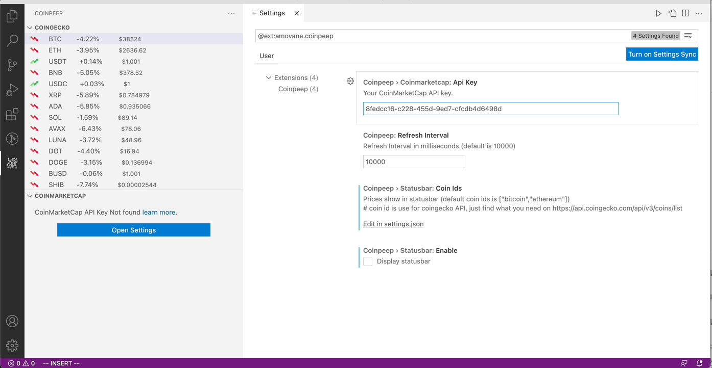

# README

<h3 align="center"> Coinpeep <h3>

 
</img>

<h3 align="center">A vscode extension for help to take a quick peep of cryptocurrency prices as you code.</h3>

## Install

via [Marketplace](https://marketplace.visualstudio.com/items?itemName=amovane.coinpeep)

## Features ✨

- Using [CoinGecko](https://www.coingecko.com/) and [CoinMarketCap](https://coinmarketcap.com/) to fetch cryptocurrency prices.

- Display top 100 coins on sidebar.
- Display the most concerned coins on statusbar.

## Extension Settings ⚙️

- `coinpeep.coinmarketcap.apiKey` : your coinmarketcap api key, please apply on https://pro.coinmarketcap.com/
- `coinpeep.refreshInterval` : interval for refresh cryptocurrency prices
- `coinpeep.statusbar.enable"` : enable or disable to display on statusbar
- `coinpeep.statusbar.coinIds` : coin ids ars use for coingecko API, default is `["bitcoin", "ethereum"]`, just find what you need on https://api.coingecko.com/api/v3/coins/list

## Release Notes

### 0.0.1

Initial release

### 0.0.2
Add extension icon
### 0.0.3
Fix known issue: invalid arguments pass into embedded tradingview

## Icons

- [Bitcoin icons](https://www.flaticon.com/free-icons/bitcoin) created by kerismaker - Flaticon

- [Increase icons](https://www.flaticon.com/free-icons/increase) created by Freepik - Flaticon

- [Decrease icons](https://www.flaticon.com/free-icons/decrease) created by Freepik - Flaticon

## Development 

- Open VS Code
- npm install installation packages
- npm run watch interactive watch mode to automatically transpile source files
- F5 to start debugging
